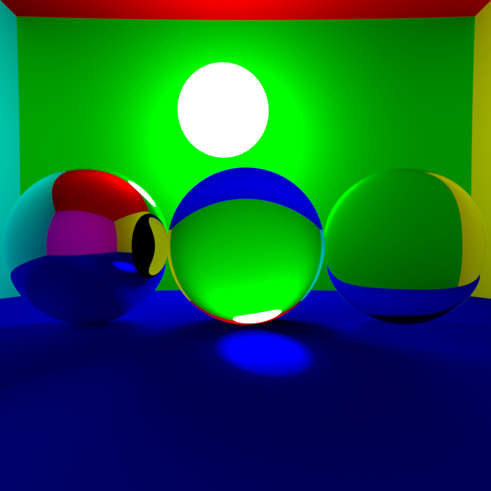

# informatique_graphique

## Rendu Antoine Lavandier

**Tous les executables utilisés pour créer les scènes sont dans le dossier [binaries](binaries). Ils ont été compilé sous Ubuntu 20.04 avec les options `-O3` et `-fopenmp`. De plus toutes les rendus sont fait avec 15 rebonds au maximum**

### Scènes simples avec des sphères

Mon Ray/Path Tracer supporte les scènes simples avec des sphères diffuses, miroirs et transparentes. La transparence utilise les coefficients de réflection et refractions de Fresnel. De plus les images sont toutes anti-aliasées et utilise la correction gamma

Scène 1 :

- 6 sphères pour faire les murs
- Une sphère diffuse
- Deux sphères transparentes, une pleine et une creuse
- Une sphère miroir
- 512 * 512 pixels et 200 rayons par pixel
- Temps de rendu : 1 minutes, 22 secondes

Scène 2 : comme la scène 1 mais avec 2000 rayons par pixels

### Scènes avec des maillages

Mon Ray/Path Tracer supporte les maillages .obj avec et sans textures. Les maillages peuvent aussi être rendu transparent ou miroir.
Le rendu des maillages utilise l'interpolation des normales.

Scène 3 :

- 6 sphères pour faire les murs
- Maillage cat.obj non texturé
- 512 * 512 pixels et 4 rayons par pixel
- Aucune optimisation pour la détection de collisions entre rayons et maillage
- Temps de rendu : 6 minutes et 28 secondes

Scène 4 :

- 6 sphères pour faire les murs
- Maillage cat.obj non texturé
- 512 * 512 pixels et 4 rayons par pixel
- Optimization avec une simple Bounding Box pour la détection de collisions entre rayons et maillage
- Temps de rendu : 37 secondes soit un peu moins d'un dixième du temps nécessaire pour la scène précédente (9.53 %)

Scène 5 :

- 6 sphères pour faire les murs
- Maillage cat.obj non texturé
- 512 * 512 pixels et 4 rayons par pixel
- Optimization avec un BVH qui utilise une division en nombre de triangles égaux pour la détection de collisions entre rayons et maillage
- Temps de calcul du BVH : 889 microsecondes
- Temps de rendu : 1 secondes et 403 millisecondes (0.36% du temps sans optimisation)

Scène 6 :

- 6 sphères pour faire les murs
- Maillage cat.obj non texturé
- 512 * 512 pixels et 4 rayons par pixel
- Optimization avec un BVH qui utilise la Split Area Heuristic pour la détection de collisions entre rayons et maillage
- Temps de calcul du BVH : 1560 microsecondes
- Temps de rendu : 1 secondes et 376 millisecondes

Ici on voit que les deux BVH ont des performances comparables. On va refaire les scène 5 et 6 avec 200 rayons par pixel pour essayer de voir si il y a une méthode meilleure que l'autre.

Scène 7 :

- 6 sphères pour faire les murs
- Maillage cat.obj non texturé
- 512 * 512 pixels et 200 rayons par pixel
- Optimization avec un BVH qui utilise la Split Area Heuristic pour la détection de collisions entre rayons et maillage
- Temps de calcul du BVH : 1577 microsecondes
- Temps de rendu : 1 minutes et 19 secondes

Scène 8 :

- 6 sphères pour faire les murs
- Maillage cat.obj non texturé
- 512 * 512 pixels et 200 rayons par pixel
- Optimization avec un BVH qui utilise une division en nombre de triangles égaux pour la détection de collisions entre rayons et maillage
- Temps de calcul du BVH : 2991 microsecondes
- Temps de rendu : 1 minutes et 32 secondes

On remarque le BVH avec le Split Area Heuristic permet des rendus un peu plus rapide qu'avec l'autre méthode de division.

Scène 9 :

- 6 sphères pour faire les murs
- Maillage cat.obj texturé
- 512 * 512 pixels et 200 rayons par pixel
- Optimization avec un BVH qui utilise la Split Area Heuristic pour la détection de collisions entre rayons et maillage
- Temps de calcul du BVH : 2970 microsecondes
- Temps de rendu : 1 minutes et 25 secondes

Scène 10 :

- 6 sphères pour faire les murs
- Maillage cat.obj transparent
- 512 * 512 pixels et 200 rayons par pixel
- Optimization avec un BVH qui utilise la Split Area Heuristic pour la détection de collisions entre rayons et maillage
- Temps de calcul du BVH : 2970 microsecondes
- Temps de rendu : 1 minutes et 20 secondes

**Note : Les 10 scènes précedentes ont la gauche et la droite inversée à cause d'une erreur dans le définition des directions**

### Autre scènes

Une scène avec de la transparence sans réfléction de Fresnel mais avec 1024 * 1024 pixels et 5000 rayons par pixels

Une scène similaire à la scène 9 mais à avec un angle de vue de caméra différent.

Une scène sans l'interpolation des normales

